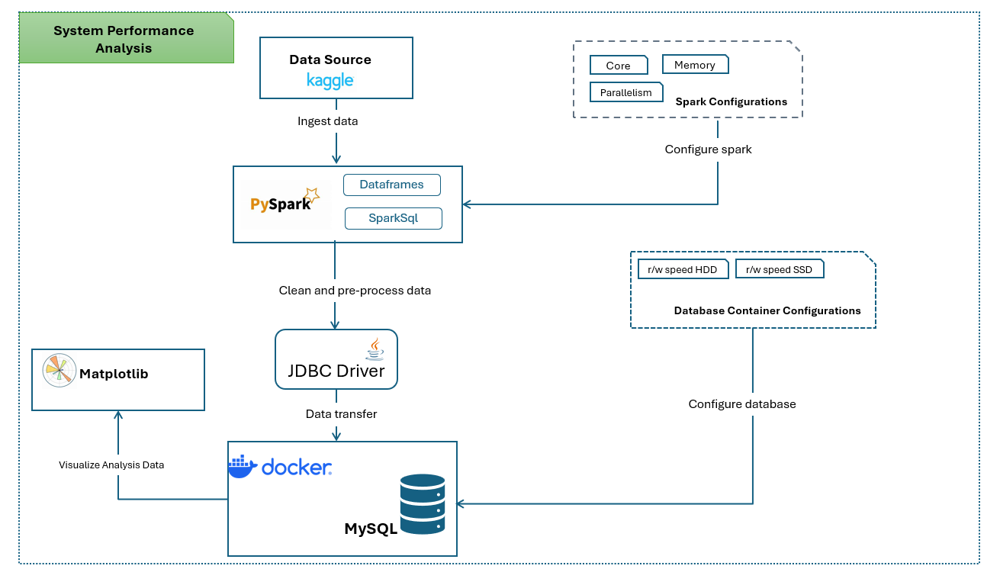

# CS532 Final Project
The Final Project for COMPSCI CS532 - Systems for Data Science.

This project showcases the complete workflow of handling large datasets, including ingestion, cleaning, transformation, and storage using modern data engineering tools. The pipeline involves downloading datasets from Kaggle, processing them with PySpark, and storing the cleaned data in a MySQL database hosted in a Docker container. Additionally, the project evaluates system performance by benchmarking batch ingestion under different configurations.

Key components:
- **Data Download**: Automate dataset retrieval from Kaggle using the Kaggle API.
- **Data Cleaning**: Use PySpark to clean and preprocess raw datasets.
- **Data Storage**: Store cleaned data into a MySQL database using PySpark and JDBC.
- **Performance Benchmarking**: Analyze ingestion and query processing performance under varying configurations.

## Goals Checklist
- [x] Set up a MySQL database in a Docker container.
- [x] Test Python connectivity to the MySQL database.
- [x] Find and load the dataset with correct instructions.
- [x] Clean each relevant dataset and combine datasets using PySpark.
- [x] Ingest cleaned data into the MySQL database.
- [x] Benchmark batch ingestion performance with varying hardware configurations.
- [x] Plot performance insights comparing execution time vs hardware constraints.
- [x] Plot performance insights comparing rows processed per second.
- [x] Configure the Read and Write Speeds of the Database to simulate the SSD and HDD.
- [x] Measure the performance for performing queries on the data using Htop/lotop
- [x] Plot a chart highlighting insights comparing query time vs. drive technology

## System Design




## Prerequisite Software
1. Docker Daemon
2. Docker Compose
3. Python 3.x
4. PySpark
5. MySQL Connector for Python
6. Python-dotenv
7. Kaggle API
8. MatPlotLib
9. Tabulate


## Setup
### Note: We have tested this only in Ubuntu VM
### Install packages

1. **Update package lists**
    ```sh
    sudo apt update
    ```

2. **Install OpenJDK 8**
    ```sh
    sudo apt install openjdk-8-jdk -y
    ```

3. **Install PySpark**
    ```sh
    pip install pyspark
    ```

4. **Install Python-dotenv**
    ```sh
    pip install python-dotenv
    ```

5. **Install Kaggle API**
    ```sh
    pip install kaggle
    ```
6. **Install MatPlotLib**
    ```sh
    pip install matplotlib
    ```
7. **Install Tabulate**
    ```sh
    pip install tabulate
    ```


### Setup Environment File
Create a `.env` file in the [setup](./setup) directory and enter the following values. This file should **not** be committed to version control.
Update the Mysql username and password at this stage if required.

```sh
MYSQL_DATABASE=mydb
MYSQL_USER=myuser
MYSQL_PASSWORD=mypassword
MYSQL_ROOT_PASSWORD=rootpass
MYSQL_HOST=localhost
MYSQL_PORT=3306
MYSQL_DRIVER=com.mysql.cj.jdbc.Driver
KAGGLE_USERNAME=your_kaggle_username
KAGGLE_KEY=your_kaggle_api_key
 ```


### Getting Kaggle Credentials
1. Go to [Kaggle Account Settings](https://www.kaggle.com/settings/account).
2. Scroll down to the API section.
3. Click on `Create New API Token`. This will download a file called `kaggle.json`.
4. Open the `kaggle.json` file in a text editor. It will look like this:
```sh
{
  "username": "your_kaggle_username",
  "key": "your_kaggle_api_key"
}
 ```
5. Copy the `username` and `key` values and paste them into the `.env` file under `KAGGLE_USERNAME` and `KAGGLE_KEY`.


### Download Dataset from Kaggle

To download the dataset, follow these steps:

1. Ensure the `.env` file is correctly set up with your Kaggle credentials:

```sh
KAGGLE_USERNAME=your_kaggle_username
KAGGLE_KEY=your_kaggle_api_key
```

2. Run the `DataDownload.py` script:

```sh
cd src
python DataDownload.py
```

3. The dataset will be downloaded and unzipped into the [data](./data) directory.


## Testing Database Connectivity

1. Verify if all the MYSQL configuratations are added in `.env` as desired.

2. Start the database container
From the [setup](./setup) directory, run :

```sh
`docker-compose up -d` 
```
This starts the database in detached mode with the credentials specified in the `.env` file.

3. Verify if the container started up, run:

```sh
`docker ps` 
```

4. Create a sample database to test connectivity, run:
```sh
`docker exec -it mysqldb mysql -u MYSQL_USER -D MYSQL_DATABASE -p` 
```
Make sure to replace the correct values from the `.env` file

5. Execute the following script
create an `employees` table with some sample data:

```sh
CREATE TABLE IF NOT EXISTS employees (
    id INT PRIMARY KEY,
    name VARCHAR(100),
    age INT,
    department VARCHAR(100)
);

INSERT INTO employees (id, name, age, department)
VALUES
(1, 'Alice', 30, 'Engineering'),
(2, 'Bob', 25, 'Marketing'),
(3, 'Charlie', 35, 'HR'),
(4, 'David', 40, 'Engineering'),
(5, 'Eve', 28, 'Finance');
```

6. Run `TestDatabaseSetup.py` to verify the data:

```sh
cd src
python TestDatabaseSetup.py
```

7. You should see the following output:

```sh
+---+-------+---+-----------+
| id|   name|age| department|
+---+-------+---+-----------+
|  1|  Alice| 30|Engineering|
|  2|    Bob| 25|  Marketing|
|  3|Charlie| 35|         HR|
|  4|  David| 40|Engineering|
|  5|    Eve| 28|    Finance|
+---+-------+---+-----------+
```

## Running the Application
 
1. Start the database container
From the [setup](./setup) directory, run 
```sh
`docker-compose up -d`
```
2. Switch to [src](./src) directory
```sh
cd src
```
3. Run `TestDatabaseSetup.py` to ensure the Database is set up correctly
```sh
python TestDatabaseSetup.py
```
4.  Run `DataCleaning.py` to  prepare datasets for benchmarking full data pipeline and store as parquet files in the [data](./data) directory.
```sh
python DataCleaning.py
```
5. Run `BenchmarkFullDataPipeline.py` to run benchmarking on full data pipeline. This will measure performance analysis on master dataframe creation and store it in the database. Once the benchmarking is complete, results will be printed in the console and stored in [results](./assets/results)

```sh
python BenchmarkFullDataPipeline.py
```
6. Run `BenchmarkDataCleaning.py` to run benchmarking on data cleaning process. This will measure performance analysis on cleaning the 20% samle of title_akas dataset. Once the benchmarking is complete, results will be printed in the console and stored in [results](./assets/results)

```sh
python BenchmarkDataCleaning.py
```
7. Once multiple runs of the benchmarking has been done and results seem stable, store the averaged data in the [results](./assets/results) folder to be later plotted using matplotlib.

Store the results from `BenchmarkFullDataPipeline.py` as `PerformanceAverageResults.csv`. The name and format **MUST** match as the sample already available in [results](./assets/results).

Store the results from `BenchmarkDataCleaning.py` as `CleaningAverageResults.csv`. The name and format **MUST** match as the sample already available in [results](./assets/results).

8. Once the above steps are done to generate the average results, run `SparkPerformanceVisualizer.py` to plot the final charts. All the charts are stored in the [charts](./assets/charts)

```sh
python SparkPerformanceVisualizer.py
```
